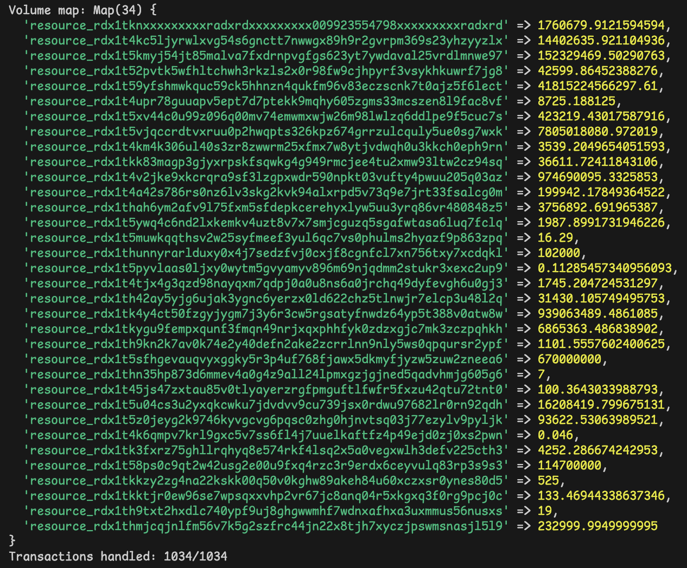

This script is meant to be a "good enough" proof of the WOWO DeFi Connect Telegram bot crossing 1 million XRD in total trade volume.
Unfortunately, it is a bit difficult to gather fully accurate volume numbers taking into account the market price of Radix alts at the time of the transaction after the fact. The WOWO bot is built to fire and forget, so I do not store that price information. Still, we can confidently prove that 1M XRD was crossed. I will likely build some transaction tracking for future analytics purposes to prevent having to do this again.

I started by identifying swap transactions done using the bot by filtering for its signature message, which is `Swap using WOWO TIP & SWAP BOT 🚀`. I created a CSV of the transactions that contain this message and included it in this repository as `transactions.csv`. For that, I used this SQL query with a Network Gateway PostgreSQL database:
```SQL
SELECT *
FROM ledger_transactions
WHERE message is not NULL
  AND message->>'type' = 'Plaintext'
  AND message->'content'->>'type' = 'String'
  AND message->'content'->>'value' = 'Swap using WOWO TIP & SWAP BOT 🚀';
```

Then, I process this CSV by looking up the transaction's balance changes using the Radix public gateway. Some of the rationale of the script is included in its comments.

I collect a hashmap of volume metrics per `ResourceAddress`. See the result:

Notice how the `ResourceAddress` for XRD has over 1.7M associated with it. This means that at least 1.7M XRD was used as input in a swap using the bot, proving that the bot did more than 1M in XRD sell volume.

At the time of writing, the bot quotes 3,410,900 XRD in total volume. Proving this aggregated metric conclusively is more difficult after the fact, as the amounts are calculated by market prices at the time the transaction is executed. The missing volume here is all the volume from selling alts for XRD, or alts for alts, and mostly comes from WOWO, xUSDC and HUG volume. Decisively proving that metric is out of the scope of this script, but I can make the following observation: If we assume that users sell about as much as they buy against XRD, then this metric would make sense considering that 1.7M (the XRD sell volume) * 2 = 3.4M XRD of volume.


## Install

1. Install [node.js](https://nodejs.org/en/download/), [yarn](https://yarnpkg.com/getting-started/install) (or use npm).
2. Clone this repository, and using a terminal navigate to its directory.
3. Run `yarn` or `npm install` to install the dependencies.

## Run

1. Build the code using `npm run build`
2. Run the script using `npm start`

